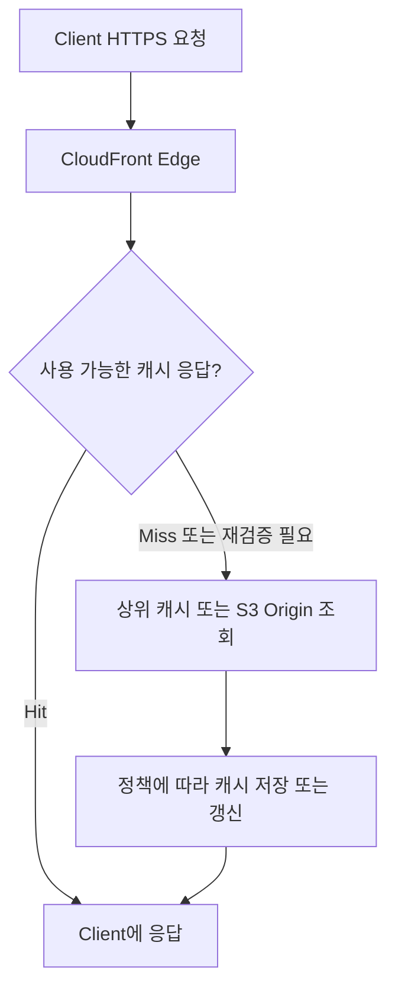

# CDN, CloudFront와 S3: 전송 계층과 캐시 정책

## 질문 의도

“CDN은 이미지 저장소인가요? DNS, LB, 애플리케이션 캐시와 무엇이 다르고 누가 CDN을 선택하나요?”

저장·접속 대상 선택·HTTP 전달·데이터 캐싱의 역할을 구분하고 캐시 키와 정합성 요구로 정책을 설계할 수 있는지 평가합니다.

## 핵심 개념

### CDN이란 무엇이며 이미지 저장소와 어떻게 다른가요?

CDN(Content Delivery Network)은 여러 엣지 거점에서 HTTP 콘텐츠를 전달해 사용자 지연과 Origin 부하를 줄이는 전송 인프라입니다. 이미지·동영상·JS·CSS뿐 아니라 정책에 따라 HTML과 API 응답도 캐싱할 수 있습니다. AWS의 CDN이 CloudFront입니다. [CloudFront 개요](https://docs.aws.amazon.com/AmazonCloudFront/latest/DeveloperGuide/Introduction.html)

| 구성 요소 | 주요 역할 | 요청 경로에서의 위치 |
|---|---|---|
| [Route 53](route53-dns-routing.md) | DNS로 접속할 엔드포인트 안내 | HTTP 전송 전에 주소 조회 |
| CloudFront | 엣지에서 HTTP(S) 전달·응답 캐싱 | Client와 Origin 사이 |
| [ALB](load-balancer.md) | HTTP 규칙·알고리즘으로 Target 선택 | 백엔드 진입점 |
| S3 | 객체 원본 저장 | 파일 Origin |
| [Redis/Memcached](../caching/memcached-elasticache.md) | 앱의 데이터 조회·연산 캐싱 | 애플리케이션과 원본 DB 사이 등 |

S3는 Object Storage이며 CDN이 아닙니다. 업무 파일의 원본 객체를 보관하고 CloudFront는 그 응답의 복사본을 전달할 수 있습니다. CDN이 파일의 유일한 원본을 보관한다는 전제로 설계하지 않습니다. [S3 개요](https://docs.aws.amazon.com/AmazonS3/latest/userguide/Welcome.html)

### CloudFront와 S3 요청 흐름은 어떻게 되나요?



모든 엣지가 모든 파일을 미리 갖는 것은 아닙니다. 요청 시 필요한 콘텐츠를 가져오며 엣지별 캐시 상태도 다릅니다. Miss가 항상 S3까지 간다는 뜻은 아니고 regional edge cache 등 상위 캐시에서 응답할 수도 있습니다. 만료된 객체는 조건부 재검증으로 재사용할 수 있으며 캐시 불가 응답은 저장하지 않습니다. [CloudFront 전달 흐름](https://docs.aws.amazon.com/AmazonCloudFront/latest/DeveloperGuide/HowCloudFrontWorks.html), [만료와 재검증](https://docs.aws.amazon.com/AmazonCloudFront/latest/DeveloperGuide/Expiration.html)

### CloudFront, Route 53과 ALB는 어떻게 함께 사용하나요?

```text
Client → DNS Resolver / Route 53: 서비스 주소 조회
Client → CloudFront: HTTPS 요청
             ├─ /images/* → S3 Origin
             └─ /api/*    → ALB → Application → Redis / DB
```

위 경로는 CloudFront behavior가 선택한 Origin을 보여주는 예시입니다. 유효한 캐시 hit이면 Origin 호출은 생략될 수 있습니다. DNS 조회는 resolver cache로 생략될 수 있으며 Route 53이 HTTP 요청을 프록시하지 않습니다. CloudFront의 Origin은 S3뿐 아니라 ALB 같은 HTTP 서버도 가능합니다.

### CDN은 정적 파일만 캐싱하나요?

공개 상품 정보처럼 여러 사용자에게 동일한 API 응답도 캐싱할 수 있습니다. 동적 요청을 CloudFront로 전달하는 것과 그 응답을 캐싱하는 것은 별개입니다. 로그인 사용자별 주문·장바구니는 일반적으로 캐싱을 끄거나 인증·응답 차이를 엄격하게 분리합니다.

### CloudFront 캐시와 Redis 캐시는 어떻게 다른가요?

CloudFront는 사용자 가까이에서 HTTP 응답을 재사용하고 Redis는 앱의 데이터/연산 결과를 재사용합니다. `CloudFront miss → 앱 → Redis hit`처럼 조합할 수 있으며 CloudFront hit이면 앱과 DB 호출이 생략될 수 있습니다. [다단계 캐시](../caching/multi-level-cache.md)의 로컬·공유 계층과 CDN 계층은 역할과 무효화 범위가 다릅니다.

## 면접 답변 예시

> CDN은 콘텐츠 전송 계층이며 S3 같은 원본 저장소와 구분됩니다. CloudFront는 요청에 따라 엣지에 HTTP 응답을 캐싱하고 Route 53은 접속할 주소를 안내하며 ALB는 백엔드 Target으로 요청을 분산합니다.

추가 설명: 모든 엣지가 모든 파일을 미리 보유하는 것은 아니며 같은 파일이 여러 엣지에 캐싱될 수 있습니다. 공개 API도 캐싱할 수 있지만 사용자별 응답은 캐시 키와 인증 처리가 안전해야 합니다. TTL·무효화·버전 URL은 변경 빈도와 허용 freshness에 맞춰 선택합니다.

## 실무 적용과 설계 판단 기준

### 오래된 캐시와 응답 차이는 어떻게 제어하나요?

| 수단 | 사용 기준 | 주의점 |
|---|---|---|
| TTL / Cache-Control | 허용 freshness와 Origin 부하 조절 | CloudFront cache policy의 Min/Default/Max TTL과 함께 평가 |
| Invalidation | 같은 URL의 캐시를 제거해야 할 때 | 반영 시간·범위·비용, Browser 캐시는 별도 |
| Versioned URL | 정적 객체 변경을 새 URL로 제공 | 앱/HTML의 참조도 새 URL로 변경해야 함 |

`/product-100-v2.jpg`처럼 이름을 바꾸거나 content hash를 넣으면 이전 URL의 응답과 분리할 수 있습니다. S3 Versioning을 켜는 것만으로 Client의 URL이나 CDN 캐시 키가 자동 변경되지는 않습니다. CloudFront invalidation도 Browser나 다른 CDN의 캐시까지 제거하지는 않습니다. [Invalidation과 파일 이름 versioning](https://docs.aws.amazon.com/AmazonCloudFront/latest/DeveloperGuide/Invalidation.html)

캐시 키는 기본 URL 경로 외에 선택한 쿼리·헤더·쿠키 등을 포함할 수 있습니다. 응답이 locale·tenant·인증 상태에 따라 달라지는데 해당 구분을 누락하면 다른 요청에 같은 응답을 전달할 위험이 있습니다. 반대로 모든 값을 넣으면 캐시 hit가 낮아지고 상태가 늘 수 있습니다. [Cache key 정책](https://docs.aws.amazon.com/AmazonCloudFront/latest/DeveloperGuide/controlling-the-cache-key.html)

Origin request policy로 값을 Origin에 전달하는 것과 cache policy로 키를 나누는 것은 다릅니다. 헤더를 전달했다는 이유만으로 응답이 분리되지 않습니다. 사용자별 요청은 캐싱 비활성화와 필요한 인증 정보 전달을 함께 검증합니다. [Origin request policy](https://docs.aws.amazon.com/AmazonCloudFront/latest/DeveloperGuide/controlling-origin-requests.html)

특히 Minimum TTL이 0보다 크면 Origin이 `no-cache`, `no-store`, `private`를 보내도 CloudFront가 최소 TTL 동안 캐싱할 수 있습니다. 따라서 응답 헤더만 보고 개인정보 캐싱이 꺼졌다고 가정하지 않습니다. 캐싱을 끄는 behavior의 TTL 설정, 인증 전달과 실제 hit/miss를 확인합니다. [Cache policy TTL](https://docs.aws.amazon.com/AmazonCloudFront/latest/DeveloperGuide/cache-key-understand-cache-policy.html)

### 이미지·가격·재고의 정책은 어떻게 달라지나요?

| 데이터 | 설계 방향 |
|---|---|
| 상품 이미지 | S3 원본과 CDN, 버전 URL이면 긴 TTL 고려 |
| 상품명·설명 | 변경 빈도와 허용 age에 따라 CDN/앱 캐시 선택 |
| 가격 | 사용자·할인·통화별 차이와 최신성에 따라 짧은 TTL 또는 캐싱 제외 |
| 재고 | 조회용 표시는 지연 허용 여부 판단, 최종 주문은 원본의 원자적 검증/예약 필요 |

표는 업무 요구에 따른 설계 예시입니다. 정확한 TTL 수치는 트래픽·SLO·데이터 정책으로 정합니다. CDN·앱 캐시의 무효화와 Browser cache는 각각의 범위를 확인합니다.

### 어떤 CDN을 사용할지는 누가 어디에서 결정하나요?

서비스 운영자가 CDN 사업자, Distribution, Origin과 behavior를 구성합니다. Client는 예를 들어 `https://cdn.example.com/products/100.jpg`를 호출합니다. Route 53은 CloudFront를 가리키는 Alias를 설정할 수 있고 다른 DNS 제공업체도 사용할 수 있습니다. [Route 53 → CloudFront](https://docs.aws.amazon.com/Route53/latest/DeveloperGuide/routing-to-cloudfront-distribution.html)

DNS 연결 외에 Distribution의 alternate domain name과 해당 이름을 포함한 TLS 인증서도 필요합니다. ACM 인증서를 CloudFront에서 사용할 때는 US East (N. Virginia) 리전 조건을 확인합니다. [CloudFront HTTPS 설정](https://docs.aws.amazon.com/AmazonCloudFront/latest/DeveloperGuide/using-https-alternate-domain-names.html)

### 어느 Edge Location으로 요청할지는 어떻게 결정되나요?

CloudFront의 DNS 및 글로벌 전달 인프라가 지연과 네트워크 경로 등을 반영해 적절한 엣지로 연결합니다. Route 53의 Alias가 개별 엣지를 직접 지정하지 않으며 지리적 거리만으로 선택되는 것도 아닙니다. CloudFront 도메인 연결과 CloudFront 내부 엣지 선택을 구분합니다. [AWS 전달 방식](https://docs.aws.amazon.com/AmazonCloudFront/latest/DeveloperGuide/HowCloudFrontWorks.html)

### 모든 Edge에 같은 파일이 있나요? Memcached 샤딩과 어떻게 다른가요?

서울 엣지는 hit이고 도쿄 엣지는 miss일 수 있습니다. 동일 콘텐츠가 여러 엣지에 존재하는 것은 사용자 가까이에서 전달하기 위한 정상적인 캐시 동작입니다. [노드 기반 Memcached 샤딩](../caching/memcached-elasticache.md)은 주로 Key를 담당 노드에 분배하는 방식이며 모든 노드로 자동 복제하지 않습니다. 지역별 캐시 재사용과 Key 소유권 분배는 다른 구조입니다.

### Multi-CDN에서는 누가 사업자를 선택하나요?

DNS 기반 Traffic Manager나 별도 제어 계층이 사업자별 엔드포인트를 선택할 수 있습니다. 지역별 성능·장애·비용을 기준으로 정책을 구성하며 DNS 방식을 사용하면 캐시와 TTL·기존 연결의 영향을 받습니다. [Route 53 라우팅의 제약](route53-dns-routing.md)을 함께 고려합니다.

```text
DNS 조회: Client → DNS / Traffic Manager → CDN 엔드포인트 응답
HTTPS:   Client ─┬→ 선택된 CloudFront ─┐
                 └→ 선택된 다른 CDN ──┴→ Origin (miss / 비캐시 요청)
```

이는 Multi-CDN 설계 예시입니다. 사업자별 custom domain·TLS·캐시 키·접근 제어·무효화를 맞추고 전환 후 cold cache로 증가할 Origin 부하를 검증합니다. 한 CloudFront 구성에 별도 사업자 선택 계층이 필수인 것은 아닙니다.

## 예상 꼬리 질문과 답변

**S3를 공개해야 CloudFront로 전달할 수 있나요?** 일반 S3 bucket Origin은 OAC와 bucket policy로 CloudFront만 접근하도록 구성할 수 있습니다. S3 website endpoint는 custom origin으로 취급되고 같은 OAC 방식을 사용할 수 없습니다. [S3 Origin 접근 제한](https://docs.aws.amazon.com/AmazonCloudFront/latest/DeveloperGuide/private-content-restricting-access-to-s3.html)

**OAC만 설정하면 사용자 권한도 검증되나요?** OAC는 CloudFront → S3 접근 제어입니다. Viewer의 접근 권한은 signed URL/cookie 등 별도 정책으로 검증해야 합니다. [Signed URL](https://docs.aws.amazon.com/AmazonCloudFront/latest/DeveloperGuide/private-content-signed-urls.html)

**CDN hit가 높으면 DB 보호도 충분한가요?** miss·대량 invalidation·사업자 전환으로 Origin 부하가 급증할 수 있습니다. [Stampede](../caching/cache-stampede.md), [Avalanche](../caching/cache-avalanche.md)와 원본 예산을 함께 고려합니다.

**S3 객체를 같은 이름으로 바꾸면 즉시 새 이미지가 보이나요?** CDN과 Browser의 기존 캐시가 남을 수 있습니다. TTL·invalidation 또는 새 URL 참조가 필요합니다. 원본 갱신 성공과 전체 사용자에게 새 콘텐츠가 보이는 시점은 다릅니다.

## 한계 / 주의점 및 답변 보완

CDN 가용성과 Origin 데이터의 정합성은 다른 문제입니다. 전달이 성공해도 오래된 내용일 수 있고 TTL이 끝나기 전에 eviction이 발생할 수도 있습니다. 캐시 hit/miss·오류·Origin 지연과 freshness를 함께 관측합니다. [운영 알림](../resilience/operational-alerting.md)의 사용자 영향 기준을 적용할 수 있습니다.

이 문서는 일반 원리와 설계 예시이며 실제 Distribution·S3·DNS 생성, 무효화나 Multi-CDN 장애 전환 시험 결과가 아닙니다.

## 관련 문서 / 공식 참고 자료

자료 확인일: 2026-10-08. AWS 기능은 링크된 latest 문서 기준이며 실제 Distribution의 정책과 지원 옵션을 별도로 확인합니다.

- [Route 53](route53-dns-routing.md), [Load Balancer](load-balancer.md), [다단계 캐시](../caching/multi-level-cache.md), [Memcached](../caching/memcached-elasticache.md)
- [CloudFront 개발자 가이드](https://docs.aws.amazon.com/AmazonCloudFront/latest/DeveloperGuide/Introduction.html), [전달 흐름](https://docs.aws.amazon.com/AmazonCloudFront/latest/DeveloperGuide/HowCloudFrontWorks.html)
- [Cache key](https://docs.aws.amazon.com/AmazonCloudFront/latest/DeveloperGuide/controlling-the-cache-key.html), [Expiration](https://docs.aws.amazon.com/AmazonCloudFront/latest/DeveloperGuide/Expiration.html), [Invalidation](https://docs.aws.amazon.com/AmazonCloudFront/latest/DeveloperGuide/Invalidation.html)
- [S3 공식 문서](https://docs.aws.amazon.com/AmazonS3/latest/userguide/Welcome.html)
