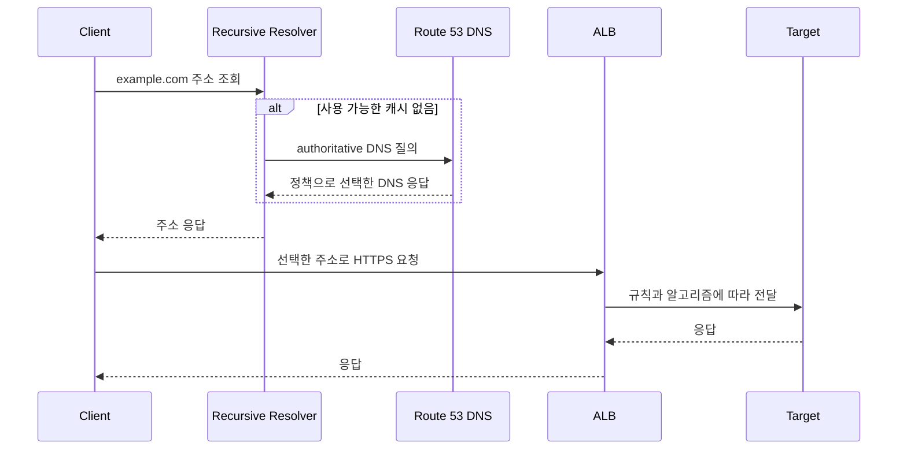

# AWS Route 53: DNS 라우팅과 Load Balancer의 차이

## 질문 의도

“Route 53은 DNS인데 어떻게 Load Balancing을 하나요? ALB와 무엇이 다르고 53은 무슨 뜻인가요?”

DNS 응답으로 접속 대상을 선택하는 것과 실제 연결·요청을 분산하는 것을 구분할 수 있는지 평가합니다.

## 핵심 개념

### Q1. Route 53은 무엇이며 숫자 53은 무슨 뜻인가요?

Route 53은 AWS의 DNS 서비스이며 도메인 등록·health check 등의 기능도 제공합니다. 여기서는 authoritative DNS의 라우팅을 중심으로 설명합니다. 이름의 53은 전통적인 DNS 질의에 사용하는 TCP/UDP 포트 53에서 유래합니다. 버전 번호나 LB 알고리즘 번호가 아닙니다. [AWS Route 53 기능](https://aws.amazon.com/route53/features/)

### Q2. Route 53과 ALB는 어떻게 다른가요?

| 구분 | Route 53 DNS 라우팅 | [ALB](load-balancer.md) |
|---|---|---|
| 선택 시점 | authoritative DNS 질의에 응답할 때 | Listener 규칙과 Target Group으로 HTTP 요청 처리 시 |
| 선택 대상 | DNS record에 구성된 엔드포인트 | Target Group과 그 안의 Target |
| 주요 기준 | 가중치·지연시간·지역·health 정책 등 | host/path 규칙·Group 가중치·Target 알고리즘 등 |
| 데이터 경로 | HTTP 요청을 프록시하지 않음 | 실제 HTTP 요청/응답 경로에 위치 |
| 변경 반영 | resolver/client DNS cache와 TTL 영향 | 새 요청·연결과 해당 설정에 따라 반영 |

“Load Balancing”은 트래픽을 여러 대상으로 나누는 넓은 개념입니다. DNS가 응답하는 접속 대상을 다르게 선택해도 결과적으로 분산이 발생하므로 DNS load balancing이라고 부릅니다. ALB와 역할이 겹치는 부분은 있지만 선택 시점과 관측 단위가 다릅니다. [Route 53 FAQ](https://aws.amazon.com/route53/faqs/)

### DNS 조회와 HTTP 요청의 별도 흐름

위 흐름은 재귀 질의 과정과 중간 DNS 서버를 단순화한 것입니다. Client가 매 HTTP 요청마다 Route 53에 질의하는 것은 아닙니다. 같은 resolver의 응답을 여러 사용자가 공유할 수도 있습니다. Route 53 Alias로 ALB를 가리키면 DNS는 LB 접속 주소를 제공하고 실제 Target 선택은 ALB가 수행합니다.

### Q3. Route 53은 어떤 분산 정책을 제공하나요?

| 정책 | DNS 응답 선택 기준 | 주의점 |
|---|---|---|
| Weighted | record의 상대 가중치 | HTTP 요청량의 정확한 비율을 보장하지 않음 |
| Latency | AWS가 관측한 리전 간 지연 데이터로 적절한 리전 선택 | 개별 API 처리 시간이나 서버 CPU를 비교하는 것이 아님 |
| Failover | primary/secondary와 health 상태 | 캐시·질의 시점 때문에 즉시 전환되지 않음 |
| Geolocation | 질의 출처 위치를 기준으로 정책 선택 | 사용자 실위치와 resolver 위치가 다를 수 있음 |
| Multivalue Answer | 여러 주소 응답, health check를 연결하면 정상 주소 선택 | 주소 선택·재시도는 클라이언트 동작에도 의존 |

Simple, Geoproximity, IP-based 등의 정책도 있으며 전체 목록은 [Routing policy](https://docs.aws.amazon.com/Route53/latest/DeveloperGuide/routing-policy.html)를 확인합니다. Latency 판단은 [AWS Latency routing](https://docs.aws.amazon.com/Route53/latest/DeveloperGuide/routing-policy-latency.html)을 참고합니다.

Multivalue는 질의당 최대 8개의 healthy record를 반환할 수 있지만 LB의 대체품은 아닙니다. Health Check를 연결하지 않은 record는 서비스의 실제 정상 여부를 검사한 것이 아닙니다. Alias에는 Multivalue 정책을 사용할 수 없으므로 ALB Alias와 동일한 구성으로 설명하지 않습니다. [AWS Multivalue routing](https://docs.aws.amazon.com/Route53/latest/DeveloperGuide/routing-policy-multivalue.html)

## 면접 답변 예시

> Route 53은 DNS 응답으로 접속 엔드포인트를 선택하고 ALB는 접속 후 실제 HTTP 요청을 분산합니다. DNS 응답을 가중치나 health에 따라 다르게 반환하면 트래픽이 나뉘므로 DNS Load Balancing이라고 부를 수 있습니다. 다만 resolver와 client의 캐시, TTL과 연결 재사용 때문에 매 요청을 실시간으로 분산하는 것은 아닙니다. 여러 리전의 ALB 중 접속 대상을 Route 53이 선택하고 각 ALB가 리전 내부 Target을 분산하는 식으로 함께 사용할 수 있습니다. 이름의 53은 DNS의 표준 포트에서 유래합니다.

## 실무 적용과 설계 판단 기준

### Q4. Route 53 Weighted와 ALB Weighted Target Group은 어떻게 다른가요?

| 비교 | Route 53 Weighted | ALB Weighted Target Group |
|---|---|---|
| 선택 단위 | DNS 응답의 record | Listener forward action의 Target Group |
| 예시 | 리전 A/B의 ALB 엔드포인트 선택 | 같은 ALB의 구/신 버전 Group 선택 |
| 비율 해석 | DNS 질의 가중치, 실제 트래픽은 캐시·사용량으로 달라짐 | 설정된 Group 가중치, stickiness 등도 영향 |
| 이후 단계 | Client가 선택 주소에 접속 | 선택 Group 내부의 알고리즘으로 Target 선택 |

90:10의 DNS 가중치가 HTTP 요청 90:10을 보장하지는 않습니다. 한 resolver의 캐시를 많은 Client가 공유하고 Client마다 요청량과 연결 유지 시간이 다르기 때문입니다. [Weighted record와 TTL](https://docs.aws.amazon.com/Route53/latest/DeveloperGuide/resource-record-sets-values-weighted.html)

ALB Group 가중치는 개별 Target의 수동 가중치나 Weighted Random/ATW와 별도 기능입니다. 가중치가 설정된 Group이 비었거나 unhealthy여도 다른 healthy Group으로 자동 failover하는 것은 아니므로 배포 정책에서 대응해야 합니다. [ALB forward action](https://docs.aws.amazon.com/elasticloadbalancing/latest/application/rule-action-types.html)

### Q5. Route 53 Failover가 즉시 이루어지지 않는 이유는 무엇인가요?

1. health check의 주기와 실패 판정까지 시간이 필요합니다.
2. authoritative 응답이 변경되어도 resolver/client는 기존 응답을 캐시하고 있을 수 있습니다.
3. 이미 열린 TCP/WebSocket 등은 DNS 변경으로 새 엔드포인트에 이동하지 않습니다. 연결 실패·timeout·재연결 정책도 영향을 줍니다.

따라서 복구 목표는 health 판정, DNS TTL/cache, Client 재연결과 대체 리전 용량을 포함해 검증합니다. TTL을 낮추면 캐시 유지 시간을 줄일 수 있지만 즉시 전환을 보장하지 않습니다. Alias는 대상 AWS 리소스의 TTL을 사용하므로 일반 record처럼 TTL을 임의 설정한다고 가정하지 않습니다. [Health Check](https://docs.aws.amazon.com/Route53/latest/DeveloperGuide/dns-failover.html), [Alias 설정](https://docs.aws.amazon.com/Route53/latest/DeveloperGuide/resource-record-sets-values-alias-common.html)

Health Check를 record에 연결하거나 지원되는 Alias에서 `EvaluateTargetHealth`로 대상 health를 평가할 수 있습니다. DNS 이름의 존재만으로 업무 서비스가 정상이라는 뜻은 아닙니다. ALB 내부 Target Health와 DNS 수준 장애 전환의 범위를 구분합니다.

## 예상 꼬리 질문과 답변

**Q1. Route 53과 ALB 중 하나만 선택하나요?** 함께 사용할 수 있습니다. Route 53이 도메인을 ALB로 연결하거나 여러 리전 엔드포인트를 선택하고 ALB가 서버 요청을 분산합니다.

**Q2. DNS 가중치를 바꾸면 기존 사용자가 바로 이동하나요?** 캐시된 주소와 기존 연결은 남을 수 있습니다. 새 DNS 응답부터 바뀌더라도 사용자 요청 비율은 점진적으로 달라질 수 있습니다.

**Q3. Latency Routing은 응답이 가장 빠른 서버를 매번 고르나요?** 아닙니다. DNS 단계에서 리전 지연 데이터를 기준으로 엔드포인트를 선택합니다. 서버의 DB 지연·CPU·현재 요청 큐를 직접 비교하는 알고리즘이 아닙니다.

**Q4. Multivalue는 각 요청을 8개 서버로 순차 분산하나요?** DNS가 여러 주소를 반환하는 것입니다. 실제 주소 선택과 장애 재시도는 Client 구현에 의존하며 Round Robin 요청 분배를 보장하지 않습니다.

**Q5. Failover 구성만 있으면 재해 복구가 되나요?** 대체 엔드포인트의 데이터 정합성, 용량, 인증·설정과 전환·복귀 절차도 필요합니다. DNS 전환은 전체 복구 설계의 한 요소입니다.

가용성 평가는 [SPOF와 HA 설계](../resilience/spof-high-availability.md)의 장애 범위·공통 의존성·RTO/RPO 기준과 함께 수행합니다. DNS 전환 성공과 사용자 기능 복구 완료는 별도로 측정합니다.

## 한계 / 주의점 및 답변 보완

DNS의 health 기반 응답도 모든 대상 장애 시 정책별 처리 규칙이 있으므로 “모든 장애 주소를 항상 제외한다”고 단정하지 않습니다. [Failover 정책](https://docs.aws.amazon.com/Route53/latest/DeveloperGuide/routing-policy-failover.html)과 record health 동작을 확인합니다. DNS 라우팅은 개별 요청의 과부하 제어를 대신하지 않으며 [LB Health Check](load-balancer.md)와 [Circuit Breaker](../resilience/circuit-breaker.md)의 역할도 별도로 평가합니다.

이 문서는 동작과 설계 기준이며 실제 DNS record 변경·리전 장애 전환 시험 결과가 아닙니다.

## 관련 문서 / 공식 참고 자료

- [Load Balancer와 AWS 종류](load-balancer.md), [Circuit Breaker](../resilience/circuit-breaker.md)
- [Route 53 기능과 이름의 유래](https://aws.amazon.com/route53/features/), [Routing policy](https://docs.aws.amazon.com/Route53/latest/DeveloperGuide/routing-policy.html)
- [Weighted record](https://docs.aws.amazon.com/Route53/latest/DeveloperGuide/resource-record-sets-values-weighted.html), [Failover](https://docs.aws.amazon.com/Route53/latest/DeveloperGuide/routing-policy-failover.html)
- [ALB Listener action](https://docs.aws.amazon.com/elasticloadbalancing/latest/application/rule-action-types.html)
