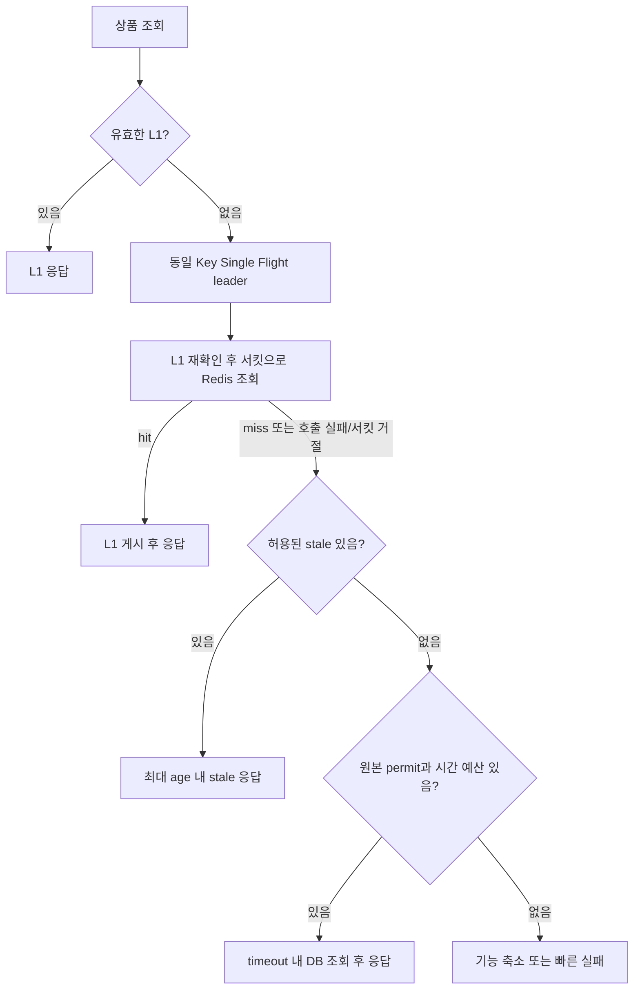

# Circuit Breaker: 장애 감지와 요청 보호

## 질문 의도

“의존성 장애와 지연을 어떻게 감지하나요? 서킷이 열리면 요청은 어떻게 처리하나요?”

호출 결과를 장애 신호로 분류하고 차단·fallback·회복 시험을 설계할 수 있는지 평가합니다. 이 문서는 Redis를 재생성 가능한 캐시로 사용하는 경우를 중심으로 설명합니다. 세션·락·원본 저장소로 쓰는 Redis에는 별도 정책이 필요합니다.

## 핵심 개념

Circuit Breaker는 관측한 의존성 호출 결과를 바탕으로 이후 호출 허용 여부를 결정합니다. timeout은 개별 호출의 대기를 제한하고, 서킷은 문제가 반복되는 의존성에 새 호출이 쌓이는 것을 줄입니다. 원인을 진단하거나 진행 중인 I/O를 자동 취소하는 장치는 아닙니다.

### 무엇을 장애로 셀 것인가

| 관측 결과 | 분류와 서킷 반영 | 함께 확인할 지표 / 조치 |
|---|---|---|
| Redis GET 성공, 값 없음 | 정상 miss. 실패로 세지 않음 | hit/miss, eviction, TTL 분포, 원본 QPS. 대량 miss는 원본 부하 제어로 대응 |
| 연결 거절·연결/명령 timeout·네트워크 오류 | 의존성 접근 실패로 기록 | 오류 종류, 호출 시간, 연결 풀 대기, Redis 상태와 네트워크 |
| 성공했지만 허용 지연 초과 | slow call로 기록 가능 | 지연 분포와 timeout 예산. 성공률만 보면 감지하지 못하는 성능 저하 |
| 역직렬화 실패·잘못된 캐시 값 | 데이터/배포 오류로 별도 관측 | 안전하면 해당 항목 무효화, 스키마/배포 확인. 전역 장애와 구분해 서킷 반영 범위 결정 |
| 사용자 입력 오류·업무상 권한 거절·not-found | 의존성 실패 판정에서 제외 | 입력/업무 오류 지표로 관측 |
| Redis 자격 증명·ACL 오류 | 의존성 접근 불가로 별도 분류 | 설정 수정과 알림 필요. 차단 범위·실패 기록 정책을 명시하고 무한 재시도 금지 |
| 서킷 OPEN으로 호출 거절 | 실제 Redis 호출 실패와 별도 집계 | `not_permitted` 수와 fallback/거절 비율 |
| DB fallback permit 부족 | 원본 보호를 위한 admission 거절 | DB 동시성·풀 대기·API 오류율. Redis 실패율에 섞지 않음 |

업무 권한 거절과 캐시 서버의 인증/ACL 오류는 다른 실패입니다. 서버가 정상이어도 앱의 자격 증명이 잘못되면 GET/SET을 수행할 수 없습니다. [Redis ACL](https://redis.io/docs/latest/operate/oss_and_stack/management/security/acl/)

예외를 잡아서 `null`로 바꾼 뒤 서킷에 반환하면 timeout이 정상 miss/성공처럼 보일 수 있습니다. **실제 의존성 호출을 서킷으로 감싸고, 실패 기록 이후 바깥에서 fallback**하도록 설계합니다. 비동기 호출은 Future 생성 시간이 아니라 실제 완료 결과와 소요 시간을 기록하는 연동을 사용합니다.

### 상태와 감지 기준

| 상태 | 의존성 호출 | 요청 처리 |
|---|---|---|
| CLOSED | 허용하며 결과 수집 | 실패율/slow call 비율이 기준에 도달하면 OPEN |
| OPEN | 새 호출 거절 | 즉시 fallback 또는 명시적 실패. 이미 실행 중인 작업은 별도 timeout으로 관리 |
| HALF_OPEN | 제한된 시험 호출만 허용 | 실패/지연 기준을 넘으면 다시 OPEN, 양호하면 CLOSED |

Resilience4j는 호출 수 또는 시간 기반 sliding window를 사용하며, 최소 관측 수가 충족되어야 비율로 OPEN을 판단합니다. HALF_OPEN 전환은 대기 시간이 지난 뒤 다음 호출이 유발하거나 자동 전환 설정으로 수행할 수 있습니다. 정확한 상태/설정 의미는 [Resilience4j 공식 문서](https://resilience4j.readme.io/docs/circuitbreaker)를 확인합니다.

서킷은 Redis read/write 등 실패 영향과 호출 예산이 다른 작업별로 분리할지 판단합니다. 상품 ID별로 서킷을 만들면 상태와 메트릭이 무한히 늘어날 수 있습니다. 일반적인 로컬 Registry는 인스턴스 간 상태를 공유하지 않으므로 특정 인스턴스만 OPEN일 수 있습니다.

## 면접 답변 예시

> Circuit Breaker는 의존성 호출의 실패나 지연을 관측해 이후 호출 허용 여부를 결정하는 보호 장치입니다. 정상 cache miss와 timeout·연결 오류를 구분하고 관측 구간, 최소 표본, 실패율과 slow call 비율로 발동을 판단합니다.

추가 설명: OPEN에서는 새 의존성 호출을 차단하며, 데이터 정책에 따라 유효한 [로컬 캐시](../caching/multi-level-cache.md), 허용된 stale, [요청 병합](../caching/single-flight.md)과 제한된 원본 fallback을 적용할 수 있습니다. 안전한 대체 응답이나 원본 예산이 없으면 빠르게 실패를 반환합니다. HALF_OPEN에서는 제한된 실제 호출로 회복 여부를 판단합니다. 운영 알림은 서킷 상태와 사용자 영향 지표를 별도로 평가하고 그룹화·반복 제어 후 담당 채널에 전달합니다. Prometheus → Alertmanager → Slack은 이를 구성하는 한 가지 구현 예시입니다.

## 실무 적용과 설계 판단 기준

### 장애 감지 시나리오와 설정 판단

아래 수치는 원리를 설명하는 **가상 예시**이며 운영 권장값이나 이 저장소의 실행 설정이 아닙니다.

- 최근 10초, 최소 완료 호출 20개, 실패율 기준 50%라면 해당 구간에 성공 12개·timeout 8개는 40%여서 실패율 조건으로 열리지 않습니다. 성공 10개·timeout 10개는 50%여서 OPEN이 됩니다.
- slow 기준 100ms, slow 비율 기준 50%라면 오류 없이 20개 중 12개가 150ms에 완료돼도 slow 조건으로 열릴 수 있습니다. slow 기준은 호출을 강제 종료하는 timeout이 아닙니다.
- 19개만 기록되면 모두 실패해도 위 최소 표본 조건을 채우지 못합니다. 저트래픽 경로는 별도의 오류 지속 알림이나 제한된 synthetic probe가 필요할 수 있습니다. probe의 성공을 실제 사용자 작업 전체의 정상으로 해석하지 않습니다.
- Redis가 응답하지만 많은 Key가 사라졌다면 서킷은 CLOSED일 수 있습니다. 대량 miss와 원본 부하 급증은 [Cache Avalanche](../caching/cache-avalanche.md) 관점으로 별도 감지합니다.
- Redis 쓰기만 실패한다면 읽기까지 일괄 차단할지 먼저 판단합니다. 캐시 쓰기 실패가 성공한 DB 조회를 실패로 바꾸거나 DB 재조회 루프를 만들지 않도록 합니다.

호출 timeout은 전체 요청 deadline 중 Redis에 할당할 예산으로 정합니다. 관측 window와 최소 표본은 트래픽에, 실패/slow 기준은 정상 분포와 SLO에, OPEN 대기와 시험 호출 수는 복구 시간과 의존성 용량에 맞춰 조정합니다. HALF_OPEN의 작업이 멈추지 않도록 실제 I/O timeout과 최대 대기 정책을 둡니다.

### 서킷 발동 후 권장 요청 흐름

OPEN에서는 Redis client 호출까지 진행하지 않습니다. HALF_OPEN은 서킷이 허용한 일부 요청만 Redis를 시험하며, 나머지는 fallback으로 보냅니다. L1 hit는 Redis 호출 결과를 만들지 않으므로 복구 판정용 표본도 만들지 않습니다.

서킷 OPEN 여부와 별개로 원본 permit·요청 deadline을 확인해야 합니다. follower 한도, stale 허용 범위와 전체 DB 예산의 기준은 [캐시 장애 중 원본 보호](redis-recovery.md)를 따릅니다.

대체 응답이 안전하지 않거나 원본 예산이 없으면 예를 들어 503으로 일시적 처리 불가를 명시합니다. 사용자별 rate limit의 429와 구분하고 응답 정책은 API 계약에 맞춥니다. OPEN 거절을 Redis 재시도로 되돌리지 않으며, 허용하는 재시도에도 deadline·횟수·backoff/jitter 예산을 둡니다. 재고·결제·권한은 오래된 값으로 성공을 꾸미지 않습니다.

DB 결과를 얻은 뒤 Redis cache put도 별도 보호 정책을 적용합니다. 재생성 가능한 캐시의 put 실패는 관측하되 원본 성공 결과를 반환하고, 무제한 재시도나 무제한 재적재 큐를 만들지 않습니다.

### 운영 알림 연결

서킷 상태·차단 호출과 API/원본 영향을 따로 수집합니다. 짧은 OPEN 반복, 지속 장애, 복구와 감시 경로 장애에 대한 규칙·그룹화·Slack 설정은 [장애 감지와 운영 알림](operational-alerting.md)에서 다룹니다.

### 복구와 검증 시나리오

HALF_OPEN 시험은 PING만이 아니라 실제 사용하는 GET 등 해당 작업의 성공과 지연을 확인해야 합니다. 인스턴스 수 × 시험 호출 수의 총량도 고려합니다. CLOSED 이후에도 cold cache와 DB fallback 부하는 남을 수 있으므로 [Redis 복구 문서](redis-recovery.md)의 점진 Warm-up과 원본 보호를 유지합니다.

| 주입/재현할 조건 | 검증할 결과 |
|---|---|
| 정상 miss 증가 | Redis 실패로 세지 않음. 원본 예산 초과 시 제한 작동 |
| 연결 끊김 / timeout | 분류한 실패 표본에 반영, 기준 충족 시 OPEN |
| 성공 응답 지연 증가 | slow 기준에 따른 OPEN, I/O timeout 별도 작동 |
| OPEN 중 대량 요청 | 신규 Redis 호출 차단, L1/stale 정책과 DB 한도 준수 |
| HALF_OPEN 실패 / 성공 | 시험 호출 수 제한, 재OPEN / CLOSED 판정 |
| Slack 전송 불가 / 메트릭 수집 중단 | 요청 처리 유지, 감시 경로 장애 식별 |
| 여러 인스턴스 OPEN 및 상태 반복 | 알림 그룹화·재통지 제어, 사용자 영향 알림 유지 |

알림 지연과 전송 실패 검증은 [운영 알림 문서](operational-alerting.md)를 참고합니다. 보호 동작의 상태 전환·실제 의존성 호출 수·요청 결과는 별도로 측정합니다.

## 예상 꼬리 질문과 답변

**Redis health check가 실패하면 바로 서킷을 열면 되나요?** health check와 실제 호출의 경로·권한·명령이 다를 수 있습니다. 실제 요청 결과를 기본 판단 근거로 삼고 probe는 저트래픽 감지나 복구 보조로 사용합니다. 선택적 캐시 장애를 앱 liveness 실패로 연결하면 재시작과 L1 유실을 반복할 수 있습니다.

**최소 표본을 크게 잡으면 안정적인가요?** 노이즈는 줄지만 저트래픽에서 감지가 늦어집니다. 호출량과 감지 목표를 함께 보고 별도 지속 오류 알림을 보완합니다.

**서킷이 열리면 DB로 보내면 되나요?** 캐시 트래픽 전체를 DB가 감당한다는 근거가 없습니다. L1/stale, 동일 Key 병합, 원본 permit, 기능 축소/빠른 실패를 함께 적용합니다.

**실패율만 알리면 되나요?** OPEN 이후 실제 호출이 줄어 실패 표본이 감소해도 장애가 지속될 수 있습니다. 상태·차단 호출·fallback·사용자 영향을 함께 보고 알림을 유지합니다.

**서킷이 CLOSED면 복구 알림을 보내나요?** 서킷 조건 해소는 보낼 수 있지만 서비스 정상화와 구분합니다. API 오류율/지연과 DB 포화가 정상인지 별도로 확인합니다.

**Retry와 Circuit Breaker 순서는요?** 감싸는 순서에 따라 재시도 각 시도를 관측할지 최종 결과만 관측할지가 달라집니다. 의존성 시도량과 사용자 요청 결과를 따로 측정하고 실제 구성 순서를 검증합니다. OPEN 거절에 대한 재시도는 하지 않습니다.

## 한계 / 주의점 및 답변 보완

서킷의 window 크기는 동시 실행 한도가 아닙니다. Bulkhead와 요청 deadline을 함께 두며, 로컬 서킷의 관측률과 전체 서비스 집계 비율도 구분합니다. 장식하는 범위에 DB fallback까지 넣으면 Redis 실패를 가리거나 DB 오류를 Redis 오류로 섞을 수 있습니다.

이 문서의 보호 정책은 설계 예시이며 실제 장애 주입 결과가 아닙니다. 운영 알림의 전달·확인·escalation은 [별도 문서](operational-alerting.md)에서 설명합니다.

## 관련 문서 / 공식 참고 자료

자료 확인일: 2026-10-08. 제품 기능은 링크된 공식 latest/current 문서 기준이며, 실제 배포의 엔진·클라이언트·프레임워크 버전과 지원 설정을 별도로 확인합니다.

- [Load Balancer와 Health Check](../networking/load-balancer.md): 대상의 정상 여부 판단과 의존성 호출 보호의 차이
- [Redis 장애 복구와 Graceful Degradation](redis-recovery.md), [Cache Avalanche](../caching/cache-avalanche.md), [Single Flight](../caching/single-flight.md)
- [Resilience4j CircuitBreaker](https://resilience4j.readme.io/docs/circuitbreaker): 상태·관측·예외 분류
- [장애 감지와 운영 알림](operational-alerting.md): metric·반복 전환 감지·Slack 통지
