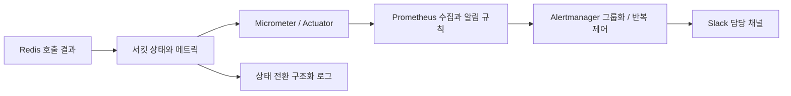

# 장애 감지와 운영 알림: Prometheus, Alertmanager와 Slack

## 질문 의도

“자동 보호가 발동하면 운영자는 어떻게 알게 되나요? 짧은 장애 반복과 복구를 어떻게 알리나요?”

호출 경로의 자동 보호와 운영자의 대응을 위한 알림을 구분하고, 사용자 영향·그룹화·전송 실패까지 설명할 수 있는지 평가합니다. Circuit Breaker를 예시로 쓰지만 원본 포화와 API 장애에도 같은 관측 원칙을 적용합니다.

## 핵심 개념

자동 보호는 요청 처리 경로에서 수행하고 알림은 별도 관측 경로에서 수행합니다. [Circuit Breaker](circuit-breaker.md)의 상태는 보호 장치의 판단이며 서비스 전체 가용성과 동일하지 않습니다. 로그는 전환 이력을, metric은 집계와 알림 조건을, trace는 요청별 의존성 경로를 설명합니다.

권장 알림 정책은 서비스 영향에 따라 정합니다.

| 상황 | 알림 / 대응 예시 |
|---|---|
| OPEN 전환, 대체 응답 정상 | 전환 로그 기록. 지속되면 담당 채널 warning |
| OPEN 여부와 무관하게 API SLO 악화·DB 포화·거절 증가 | 별도 critical 알림과 당직 호출. OPEN 알림의 대기 시간을 공유하지 않음 |
| 여러 인스턴스가 같은 의존성으로 OPEN | 서비스/환경/서킷 기준으로 묶고 영향 인스턴스 목록 제공 |
| OPEN ↔ HALF_OPEN 반복 | 회복 불안정으로 관측, 재알림 간격 제어. 강제 reset을 반복하지 않음 |
| CLOSED로 회복 | 서킷 조건 해소 알림. API·DB 영향 알림도 해소됐는지 별도 확인 |
| 메트릭 수집 중단·Slack 전송 실패 | 감시 경로 장애로 별도 알림/대체 경로 마련 |

## 면접 답변 예시

> 보호 상태와 사용자 영향 지표를 따로 관측하고 알림 조건을 평가합니다. 알림은 서비스·환경·의존성별로 묶고 심각도에 따라 담당 채널과 당직 경로로 전달합니다.

추가 설명: 짧게 반복되는 장애는 지속 시간 조건만으로 놓칠 수 있어 반복 전환도 감시합니다. 서킷 조건 해소와 서비스 복구를 구분하고 감시·전송 경로 자체의 장애도 관측합니다. Prometheus → Alertmanager → Slack은 이러한 역할을 구현하는 예시입니다.

## 실무 적용과 설계 판단 기준

### 수집과 통지 경로

일반적인 구조는 호출 결과 관측 → 보호 상태·사용자 영향 수집 → 알림 조건 평가 → 그룹화·라우팅 → 담당 채널 통지입니다. 아래는 Resilience4j/Micrometer, Prometheus, Alertmanager와 Slack으로 구현하는 예시이며, 다른 관측·알림 도구도 같은 역할을 구성할 수 있습니다.



서킷의 자동 차단은 호출 경로에서 수행하고, Slack 알림은 운영자가 상황을 판단하는 별도 경로로 둡니다. 앱이 요청마다 Slack webhook을 호출하면 알림 폭주와 Slack 지연이 요청 처리에 섞입니다. 상태 전환 로그에는 시각·인스턴스·서킷 이름·이전/새 상태를 남기고 오류 종류와 표본 수는 함께 조회할 수 있게 합니다. 짧은 OPEN/CLOSED 전환은 scrape 사이에 누락될 수 있어 전환 로그 또는 별도 전환 counter를 보완합니다.

Resilience4j의 상태, 실패율, slow 비율, 허용되지 않은 호출 수는 [Micrometer 공식 문서](https://resilience4j.readme.io/docs/micrometer)의 메트릭으로 관측할 수 있습니다. 추가로 Redis hit/miss/error, fallback/stale 비율, 원본 QPS·동시성·풀 대기, API P99·오류율·거절 수를 수집합니다. 상품 ID·요청 ID를 metric label에 넣지 않습니다.

#### Prometheus 알림 규칙 예시

아래는 지속된 OPEN/FORCED_OPEN을 알리는 문서용 예시입니다. `job="product-api"`, `service`, `environment`는 수집 설정에서 붙이고 `name`, `state`는 서킷 메트릭 label을 사용한다고 가정합니다. 실제 `/actuator/prometheus` 출력에서 이름과 label을 확인해야 합니다. 예제 앱에는 Actuator·Resilience4j·Prometheus 연동이 없습니다.

```yaml
groups:
  - name: cache-dependency
    rules:
      - alert: CacheCircuitOpen
        expr: resilience4j_circuitbreaker_state{job="product-api",name="redis-read",state=~"open|forced_open"} == 1
        for: 1m
        labels:
          severity: warning
        annotations:
          summary: 'Redis read 서킷 차단 지속: {{ $labels.instance }}'
          description: '서킷={{ $labels.name }}, 상태={{ $labels.state }}. L1/stale, DB fallback 예산, API 영향을 확인하세요.'
      - alert: CacheCircuitRepeatedOpen
        expr: increase(app_circuit_open_transitions_total{job="product-api",name="redis-read"}[5m]) >= 3
        keep_firing_for: 1m
        labels:
          severity: warning
        annotations:
          summary: 'Redis read 서킷 OPEN 반복: {{ $labels.instance }}'
          description: '최근 5분 OPEN 전환 증가량={{ $value }}. 오류 종류와 API/원본 영향을 확인하세요.'
```

`app_circuit_open_transitions_total`은 **Resilience4j 기본 metric이 아닌 직접 추가해야 하는 Counter**입니다. 상태 전환 listener에서 CLOSED/HALF_OPEN 등 다른 상태에서 OPEN으로 전환할 때 인스턴스별로 1씩 증가시키고 `name`, `service`, `environment` 등 제한된 label을 붙입니다. 최초 상태가 OPEN인 경우나 수동 FORCED_OPEN은 별도로 관측합니다. 시작 시 0을 등록해 기준 샘플을 확보하고 중복 listener 등록을 피합니다.

예를 들어 OPEN 20초 → HALF_OPEN → 재OPEN이 반복되면 `for: 1m`은 충족되지 않을 수 있습니다. 두 번째 규칙은 최근 5분의 OPEN 증가량으로 이를 보완하며 `for`를 생략해 평가 시 조건이 맞으면 firing합니다. `increase`는 reset을 보정하고 구간을 외삽하므로 정확한 정수 이벤트 수와 다를 수 있습니다. `keep_firing_for`는 조건 해소 후 잠시 firing을 유지하는 옵션이며 처음 감지에 실패한 규칙을 대신 발동시키지는 않습니다. 각 옵션의 지원 버전과 시간·횟수는 실제 환경에서 확인합니다. [Prometheus increase](https://prometheus.io/docs/prometheus/latest/querying/functions/#increase)

`for`는 조건이 연속해서 유지되어야 firing으로 전환되는 시간이며 서킷 발동 자체를 늦추지 않습니다. 이 규칙은 HALF_OPEN으로 바뀌면 조건이 해소되므로 해당 resolved를 서비스 전체 정상화로 해석하면 안 됩니다. 반복 전환은 별도 규칙으로 보완하고 API 영향 알림은 독립적으로 유지합니다. 메트릭이 사라지는 경우도 정상 복구가 아닐 수 있어 scrape 실패/메트릭 부재를 별도 감시합니다. 의미는 [Prometheus alerting rules](https://prometheus.io/docs/prometheus/latest/configuration/alerting_rules/)를 참고합니다.

#### Alertmanager → Slack 설정 예시

```yaml
route:
  receiver: slack-cache
  group_by: [alertname, service, environment, name]
  group_wait: 30s
  group_interval: 5m
  repeat_interval: 1h

receivers:
  - name: slack-cache
    slack_configs:
      - api_url_file: /etc/alertmanager/secrets/slack-webhook-url
        channel: '#backend-alerts'
        send_resolved: true
        title: '[{{ .Status }}] {{ .CommonLabels.alertname }}'
        text: >-
          {{ range .Alerts }}
          {{ .Annotations.summary }}
          {{ .Annotations.description }}
          {{ end }}
```

이 설정은 warning 흐름을 보여주는 최소 예시입니다. 운영에서는 서비스 담당 채널 라우팅과 critical용 당직 receiver를 별도로 구성합니다. `group_wait`는 최초 그룹 알림 대기, `group_interval`은 기존 그룹 변경 알림 주기, `repeat_interval`은 계속 firing인 알림의 재통지 간격입니다. 모든 예시 시간은 팀 대응 목표에 맞춰 조정합니다. [Alertmanager 공식 설정](https://prometheus.io/docs/alerting/latest/configuration/)에 그룹화·라우팅·Slack receiver 옵션이 정의되어 있습니다.

Slack App에서 Incoming Webhooks를 활성화하고 담당 채널에 권한을 부여한 webhook을 발급한 뒤, URL을 Secret 관리 도구나 접근 제한된 파일로 주입합니다. Incoming Webhook은 발급 시 연결된 채널을 사용하므로 위 `channel`과 맞춰 발급하고 채널 override에 의존하지 않습니다. URL을 저장소·로그·알림 본문에 남기지 않습니다. 실제 생성/권한 절차는 [Slack Incoming Webhooks 공식 문서](https://docs.slack.dev/messaging/sending-messages-using-incoming-webhooks/)를 참고합니다.

알림에는 환경·서비스·의존성·발생 시각·영향 인스턴스, 관측한 오류/지연, 적용 중인 fallback, 사용자 영향, 대시보드와 runbook 링크를 포함합니다. 확인 전 원인을 “Redis 서버 장애”로 단정하지 말고 “Redis timeout 증가/서킷 OPEN”처럼 관측 사실로 표현합니다. Slack 알림 실패가 서비스 요청 결과를 바꾸지 않게 하고 전송 실패 지표·제한된 재시도·critical의 대체 연락 경로를 운영합니다.

## 예상 꼬리 질문과 답변

**서킷이 열릴 때마다 Slack으로 직접 보내면 되나요?** 전환 이력은 남기되 요청 경로에서 동기 전송하지 않습니다. 수집·그룹화·반복 제어를 거쳐 전달하고 알림 실패가 업무 요청에 전파되지 않도록 합니다.

**OPEN이 짧게 반복되면 어떻게 감지하나요?** 지속 OPEN 규칙과 별도로 전환 counter나 차단 호출 비율을 감시합니다. 실제 metric을 수집하는지와 scrape 누락·재시작을 검증해야 합니다.

**resolved면 정상 복구인가요?** 해당 규칙의 조건 해소를 의미합니다. HALF_OPEN 전환이나 metric 소실도 조건을 해소할 수 있으므로 API·원본 지표와 수집 상태를 함께 확인합니다.

**Slack 알림이 도착하면 대응이 보장되나요?** 전달과 담당자 확인은 다릅니다. 심각도별 담당자·응답 목표·미확인 시 escalation과 critical의 대체 연락 경로를 정합니다.

## 한계 / 주의점 및 답변 보완

알림 임계값과 시간은 가상 예시이며 운영 권장값이 아닙니다. metric 수집 → 규칙 평가 → firing 대기 → Alertmanager 대기 → Slack 도착까지 시간을 측정합니다. `for: 1m`과 `group_wait: 30s` 외에도 scrape/evaluation 주기와 전송 시간이 추가됩니다.

YAML 문법과 실제 알림 동작 검증은 다릅니다. 적용 환경에서 `promtool check rules`, `promtool test rules`, `amtool check-config` 등으로 지원 버전·규칙·라우팅을 확인하고 테스트 채널에서 firing/resolved·그룹화·전송 실패를 시험합니다. 이 저장소의 예제 앱에는 관측 연동이 없으며 실제 Slack 전송 결과를 포함하지 않습니다.

## 관련 문서 / 공식 참고 자료

자료 확인일: 2026-10-08. 제품 기능은 링크된 공식 latest/current 문서 기준이며, 실제 배포의 엔진·클라이언트·프레임워크 버전과 지원 설정을 별도로 확인합니다.

- [Circuit Breaker](circuit-breaker.md), [캐시 장애 중 원본 보호](redis-recovery.md)
- [Resilience4j Micrometer](https://resilience4j.readme.io/docs/micrometer)
- [Prometheus alerting rules](https://prometheus.io/docs/prometheus/latest/configuration/alerting_rules/), [increase](https://prometheus.io/docs/prometheus/latest/querying/functions/#increase)
- [Alertmanager configuration](https://prometheus.io/docs/alerting/latest/configuration/), [Slack Incoming Webhooks](https://docs.slack.dev/messaging/sending-messages-using-incoming-webhooks/)
